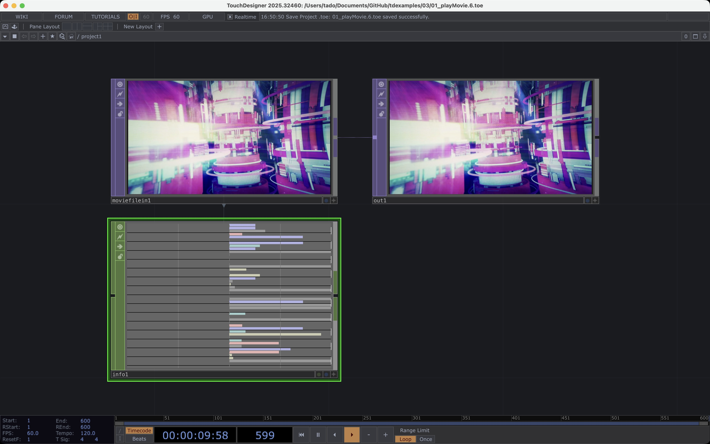
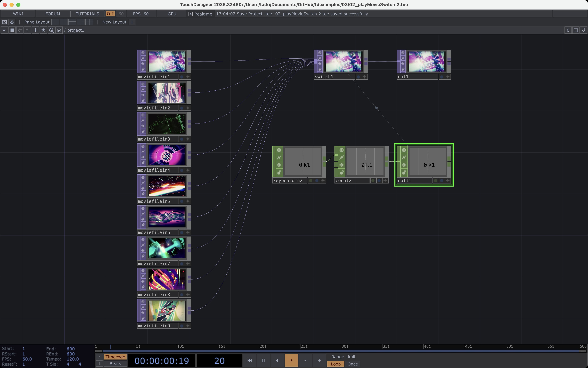
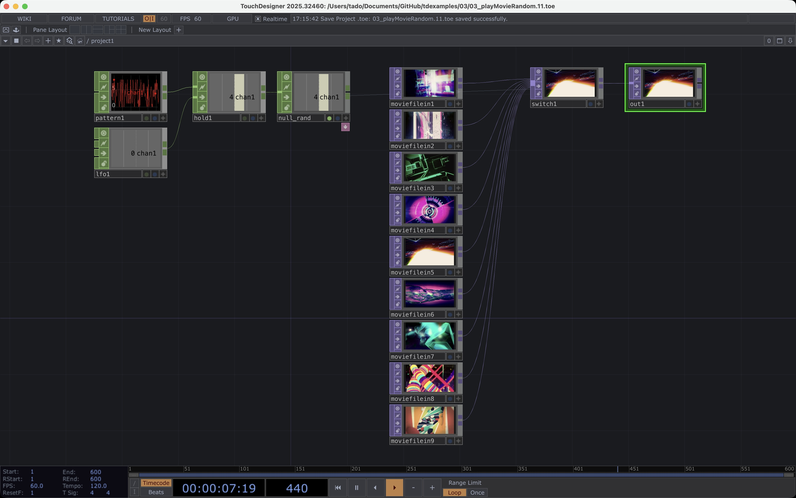
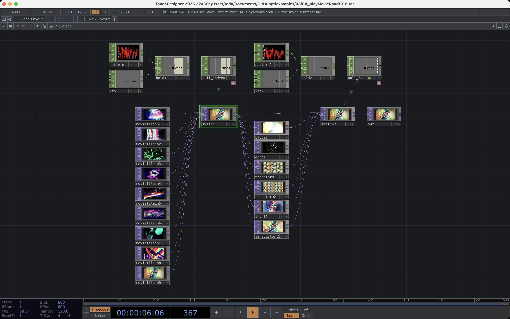
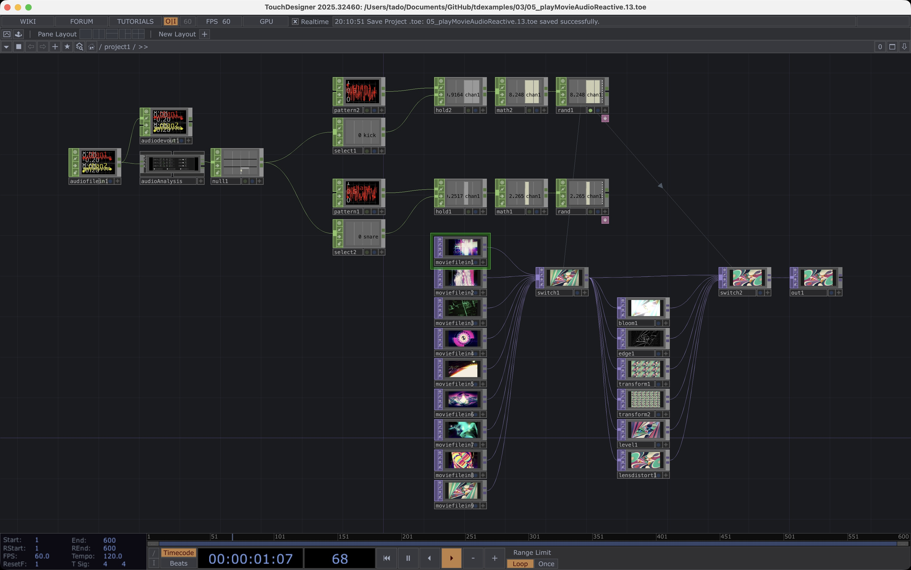

## メディアアート・プログラミング I
# 動画ファイルの再生とミックス

東京藝術大学芸術情報センター (AMC)
田所 淳

---

## 本日の内容

- 動画素材の紹介 (Beeple Free VJ Loops)
- 動画ファイル再生の基本 - 読込み、再生、停止、ループ
- 映像のスイッチング
- インタラクション (キーボード)
- 音に反応して映像を切り替える
- 簡単なGUIを作成してみる

---

## 動画素材の紹介

- 映像を扱ったプログラムを作成するにあたって、素材の映像が必要
- 今回は、BeepleのFree VJ Loopsを使用してみましょう!

---

### Beeple (Mike Winkelmann)

- https://www.beeple-crap.com/
- パデュー大学で計算機科学を専攻、1999年からデジタルアーティストとして活動
- Everydaysプロジェクト：2007年5月から1日も欠かさず毎日アート作品を制作し、5,000日以上継続している
- 2021年に自身の5,000日分の作品が約6,900万ドルで落札され、NFTブームを象徴する存在に
- ポップカルチャーや政治を風刺する作品で知られる

---

### Free VJ Loops

- https://www.beeple-crap.com/vjloops
- クリエイティブ・コモンズ・ライセンスの下、商用・非商用問わず誰でも無料で利用可能
- Cinema 4Dなどのプロジェクトファイルも公開されており、教育や改変のためのリソースとしても提供されている

---

## 動画の再生の基本

### Movie File In TOP

- 動画、静止画、連番画像、およびWeb上のリソース（URL指定）を読み込み、TOPs（テクスチャ）として利用可能
- .mov, .mp4などの主要動画形式から、Hap, NotchLC, Cineformといった高パフォーマンスなコーデックまで幅広くサポート
- Timelineへの同期（Locked to Timeline）、自由な再生（Sequential）、インデックス指定（Specify Index）など柔軟な再生モードを搭載
- Info CHOPを接続することで、解像度やFPS、デコード状況、ドロップフレーム数などの詳細情報をリアルタイムで監視できる

---

### Movie File In TOPで映像を再生

- 映像のソースを指定して再生 - 相対パスにしておくとプロジェクトを移動してもリンク切れしない
- TOP to Chopでinfo CHOPに接続すると詳細な情報が参照可能
- 再生スピードや再生モードなどを変更可能

---

## 動画の再生の基本

いろいろな方法で、動画をスイッチングしたりエフェクトをかけてみましょう!

1. Switch TOPによる映像の切り替え
1. Switch TOPのランダム自動切り替え
1. エフェクトもランダムに適用
1. 音楽 (音) に反応して切り替える

---

### Switch TOPによる映像の切り替え

- 複数のMovie File In TOPをSwitch TOPに接続
- indexの値を変更することで、映像を切り替える (0, 1, 2, 3...)
- 簡単なインタラクションの導入
- Keybord In CHOP、Count CHOPを組合せてキー入力で切り替えてみる

---

### Switch TOPのランダム自動切り替え

- Pattern CHOP (random) + LFO CHOP (Pulse) + Hold CHOPでランダムな番号を生成
- Switch TOPのIndexの値にExportして、ランダムに映像を切り替えてみる

---

### エフェクトもランダムに適用

- さらにエフェクトもランダムに適用されるようにしてみる
- エフェクト系のTOP (Bloom, Edge, Transform, Level, Lens Distort など) 適用
- 複数のエフェクトを並列して適用した後で、Switch TOPで選択する

---

### 音楽 (音) に反応して切り替える

- 音に反応して映像やエフェクトが切り替わるようにしてみる
- 音の入力: Audio File In CHOP
- 音の解析: Audio Analysis COMP
- キックとスネアの音に反応させてみる

---

